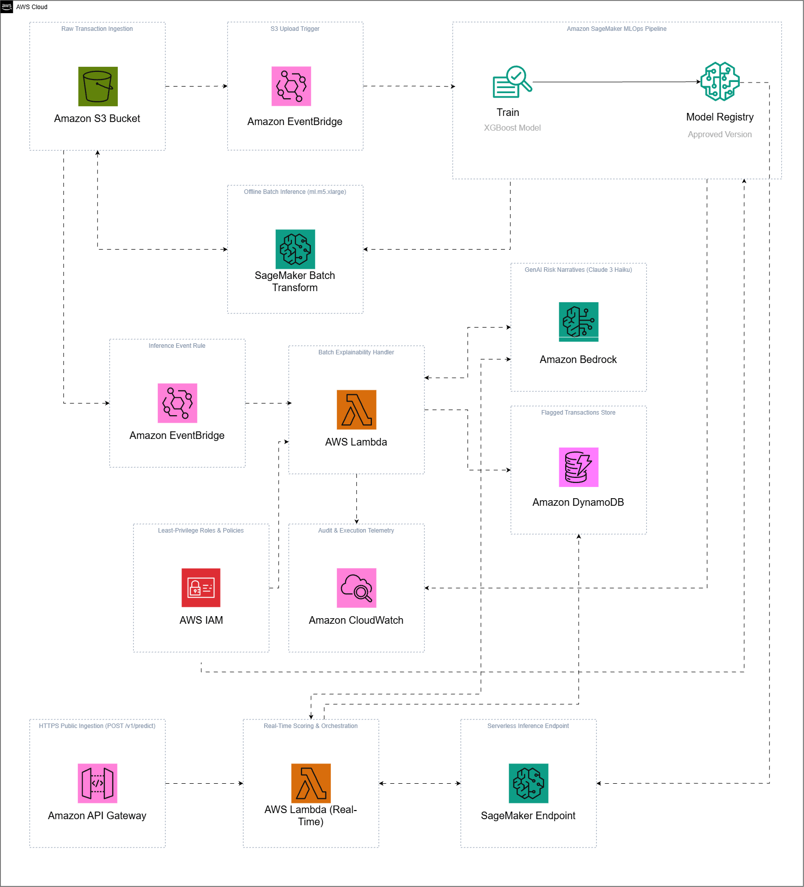
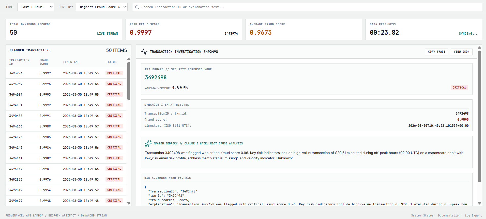

# FraudGuard — Operations & Execution Guide

This guide provides end-to-end instructions for deploying the cloud infrastructure, executing the SageMaker training pipeline, running batch inference, and inspecting AI-generated explanations in the live operations console.



---

## 📋 Prerequisites & AWS Service Quotas

1. **AWS CLI:** Configured with valid credentials (`aws configure`) in `us-east-1`.
2. **Terraform:** Version `>= 1.5.0` installed.
3. **Python:** Python 3.10+ (Python 3.12 recommended).
4. **AWS Service Quotas (Amazon SageMaker):**
   New or standard AWS accounts often default to `0` for SageMaker compute instances. Before launching jobs, verify your account has a quota of at least `1` in region `us-east-1`:
   * Navigate to **AWS Console $\rightarrow$ Service Quotas $\rightarrow$ AWS services $\rightarrow$ Amazon SageMaker**.
   * Search for `ml.m5.xlarge` and verify the following quotas:
     * `ml.m5.xlarge for processing job usage`
     * `ml.m5.xlarge for training job usage`
     * `ml.m5.xlarge for transform job usage`
   * If any value is `0`, click the quota name $\rightarrow$ **Request quota increase** $\rightarrow$ Enter `1` or `2` $\rightarrow$ Submit (approvals are usually automated and take a few minutes).

---

## 🚀 Execution Workflow

### Step 1: Virtual Environment Setup
```powershell
python -m venv .venv
.\.venv\Scripts\Activate.ps1   # Linux/macOS: source .venv/bin/activate
pip install -r requirements.txt
```

### Step 2: Infrastructure Provisioning (Terraform)
```powershell
# 1. Package the Lambda deployment artifact
Compress-Archive -Path lambda\handler.py, lambda\bedrock_client.py -DestinationPath lambda\lambda_package.zip -Force

# 2. Initialize and apply Terraform
cd infra/terraform
terraform init
terraform apply -auto-approve
cd ../..
```
*Terraform provisions the S3 bucket, DynamoDB table, IAM roles, EventBridge rules, SageMaker Model Group, and Lambda function. It also auto-generates the root `.env` file.*

### Step 3: Run Local Validation Suite
```powershell
python -m pytest tests/test_handler.py -v
```

### Step 4: Ingest Data & Trigger Training DAG
```powershell
# Upload raw dataset to S3 (EventBridge auto-triggers the SageMaker Pipeline)
.\scripts\upload_data.ps1

# Alternatively, trigger the pipeline manually
.\scripts\run_pipeline.ps1
```

**SageMaker DAG Steps:**
1. `PreprocessFraudData` — Computes 64 features and performs time-based train/val/test split.
2. `TrainFraudModel` — Trains XGBoost with `scale_pos_weight` imbalance handling.
3. `EvaluateFraudModel` — Evaluates test partition AUC-PR and ROC-AUC metrics.
4. `CheckAUCPRThreshold` — Gates registration on `AUC-PR >= 0.35`.
5. `RegisterFraudModel` — Registers model package to `fraudguard-model-group`.

### Step 5: Approve Model in SageMaker Model Registry
1. Open **AWS Console $\rightarrow$ Amazon SageMaker $\rightarrow$ Model Registry**.
2. Select **`fraudguard-model-group`** $\rightarrow$ Click latest version.
3. Click **Update approval status** $\rightarrow$ Select **`Approved`** $\rightarrow$ **Save**.

### Step 6: Execute Batch Transform
```powershell
# Runs batch scoring against latest preprocessed dataset on S3
.\scripts\run_batch_transform.ps1 -Wait
```

### Step 7: Serverless Explainability & Live Triage
When batch transform completes, predictions land in `s3://$bucket/inference-output/`:
1. EventBridge triggers the Lambda explainability handler.
2. Lambda filters high-risk records (`fraud_score > 0.90`).
3. Amazon Bedrock (Claude 3 Haiku) generates root-cause risk summaries.
4. Flagged alerts and narratives are saved to DynamoDB.

### Step 8: Launch Forensic Operations Console
```powershell
.\scripts\run_dashboard.ps1
```
*Opens `http://localhost:8080` automatically:*



---

## 🔄 Updating & Fast Iteration

* **Update Lambda Code:**
  ```powershell
  .\scripts\deploy_lambda.ps1
  ```
* **Retrain Pipeline:**
  ```powershell
  .\scripts\run_pipeline.ps1
  ```

---

## 🧹 Teardown (Clean Up Cloud Resources)

To avoid incurring ongoing AWS charges when not in use:
```powershell
cd infra/terraform
terraform destroy -auto-approve
cd ../..
```

---

## 📑 Automation Scripts Reference

| PowerShell Script | Linux / Bash Script | Purpose |
|---|---|---|
| `.\scripts\upload_data.ps1` | `bash scripts/upload_data.sh` | Uploads local raw CSV to S3 `raw/` directory. |
| `.\scripts\run_pipeline.ps1` | `bash scripts/run_pipeline.sh` | Submits and starts the SageMaker training pipeline DAG. |
| `.\scripts\run_batch_transform.ps1` | `bash scripts/run_batch_transform.sh` | Runs batch transform on S3 test data with auto-cleanup. |
| `.\scripts\deploy_lambda.ps1` | `bash scripts/deploy_lambda.sh` | Directly packages and updates Lambda function code. |
| `.\scripts\run_dashboard.ps1` | — | Launches the local forensic triage console on port 8080. |
