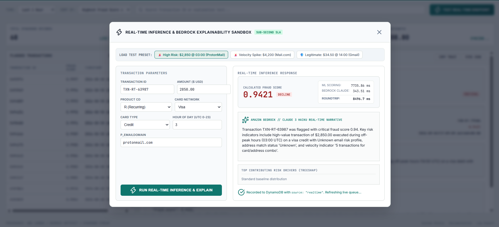

# FraudGuard 
> **Cloud-Native Fraud Detection Pipeline with Automated MLOps & GenAI Explainability**

[](https://aws.amazon.com/)
[](https://www.terraform.io/)
[](https://www.python.org/)
[](https://aws.amazon.com/sagemaker/)
[](https://aws.amazon.com/bedrock/)
[](https://aws.amazon.com/dynamodb/)

FraudGuard is an event-driven, serverless machine learning operations (MLOps) pipeline designed for financial fraud detection. It couples gradient-boosted decision trees (XGBoost) on **Amazon SageMaker** with **Amazon Bedrock (Claude 3 Haiku)** to deliver real-time natural language fraud risk narratives to security analysts—while maintaining strict cost controls.

---

## 🏛️ System Architecture


### Dual Inference Architecture: Offline Batch & Real-Time Serverless
```
                           [ DATA INGESTION & TRAINING ]
                                         │
                   S3 Bucket (raw/) ──► EventBridge Rule
                                         │
                           SageMaker MLOps Pipeline DAG
                  (Preprocess ──► Train ──► Evaluate ──► Quality Gate)
                                         │
                            SageMaker Model Registry
                         (fraudguard-model-group / Approved)
                                ┬─────────────────┬
                                │                 │
       ┌────────────────────────┘                 └────────────────────────┐
       ▼                                                                   ▼
[ PIPELINE 1: BATCH TRANSFORM ]                       [ PIPELINE 2: REAL-TIME SERVERLESS ]
       │                                                                   │
SageMaker Batch Transform (ml.m5.xlarge)              Client / Dashboard / Webhook
       │ (Scored predictions to S3)                                        │ (HTTPS POST /v1/predict)
       ▼                                                                   ▼
EventBridge S3 Rule (inference-output/)                       Amazon HTTP API Gateway (v2)
       │                                                                   │ (Proxy Integration)
       ▼                                                                   ▼
AWS Lambda (Batch Streamer)                           AWS Lambda (Real-Time Orchestrator)
       │                                                                   │
       │ (Filter: score > 0.90)                                            ├─► SageMaker Serverless Endpoint
       ▼                                                                   │   (Auto-scaled XGBoost + TreeSHAP)
Amazon Bedrock (Claude 3 Haiku)                                            │
       │ (Plain-English root cause)                                        ├─► Amazon Bedrock (Claude 3 Haiku)
       ▼                                                                   │   (On-demand explainability)
Amazon DynamoDB (flagged transactions) ◄───────────────────────────────────┘
       │
       ▼
Forensic Operations Console (http://localhost:8080)
```

---

## 💡 Key Design Decisions & Cost Architecture

| Design Decision | Implementation | Production Rationale |
|---|---|---|
| **Dual Inference Engine** | SageMaker Batch Transform for high-volume backtesting + SageMaker Serverless Endpoint for low-latency live transactions. | Gives enterprise flexibility: bulk offline throughput alongside synchronous sub-second API scoring. |
| **Serverless Real-Time Endpoint** | SageMaker Serverless Inference (`MemorySizeInMB = 2048`, `MaxConcurrency = 5`). | Scales dynamically from 0 to 5 workers with **$0 idle EC2 cost** when traffic drops to zero. |
| **Gated LLM Invocations** | Bedrock Claude 3 Haiku is invoked **only** on fraud-positive transactions (`score > 0.90`). | Keeps GenAI API costs near zero at scale ($0 spend on 98.5%+ clean traffic). |
| **Public API Gateway Proxy** | Amazon HTTP API Gateway (v2) with CORS and route `POST /v1/predict`. | Secure, low-latency, rate-limited public HTTP ingress without exposing internal Lambda ARNs. |
| **Event-Driven Decoupling** | Amazon EventBridge routes events from S3 to SageMaker and Lambda. | Eliminates polling loops and tightly couples services with native AWS retry semantics. |
| **Fully Modular IaC** | 100% codified via Terraform (`s3`, `iam`, `dynamodb`, `eventbridge`, `lambda`, `sagemaker`, `sagemaker_endpoint`, `api_gateway`). | Guarantees deterministic cloud deployments and eliminates configuration drift. |
| **Least-Privilege Security** | Distinct IAM roles for SageMaker, EventBridge, and Lambda. | Zero cross-service credential sharing or wildcard permissions. |

---

## 🖥️ Live Forensic Operations Console & Real-Time Sandbox

Inspect live flagged transactions, forensic dossiers, anomaly distributions, and Bedrock root-cause narratives, or test synchronous sub-second endpoint scoring interactively:

### Live Investigation Queue & Dossier


### Real-Time Inference & Bedrock Explainability Sandbox


```powershell
# Launch local operations console & interactive sandbox
.\scripts\run_dashboard.ps1
```
*Accessible at `http://localhost:8080` (auto-syncs with live DynamoDB alerts & allows testing cloud real-time predictions).*

---

## 📁 Repository Structure

```
FraudGuard/
├── ml/                      # Machine Learning & SageMaker Pipeline DAG
│   ├── preprocess.py        # 64-feature transformation & time-based split
│   ├── train.py             # Local XGBoost training with scale_pos_weight
│   ├── inference.py         # SageMaker serving hooks (model_fn, predict_fn, TreeSHAP)
│   ├── sagemaker_pipeline.py# SageMaker DAG (Process -> Train -> Eval -> Register)
│   ├── batch_transform.py   # Batch transform runner against approved model
│   └── model_artifacts/     # Serialized model definitions & feature defaults
├── lambda/                  # Serverless Explainability Layer
│   ├── handler.py           # EventBridge S3 parser & DynamoDB batch writer
│   ├── realtime_handler.py  # Real-time API Gateway / Lambda synchronous orchestrator
│   └── bedrock_client.py    # Anthropic Messages API client for Claude 3 Haiku
├── infra/terraform/         # Modular Infrastructure as Code (IaC)
│   ├── main.tf              # Root module wiring & Lambda permissions
│   ├── modules/             # s3, iam, dynamodb, eventbridge, lambda, sagemaker, sagemaker_endpoint, api_gateway
│   └── outputs.tf           # Auto-generates root .env configuration
├── dashboard/               # Security Forensic Node & Web UI
│   ├── server.py            # Local HTTP server streaming live DynamoDB & proxying real-time scoring
│   └── web/                 # Frontend console (HTML5, Tailwind CSS, Lucide icons, Real-Time Modal)
├── scripts/                 # Cross-platform execution automation (PowerShell / Bash)
│   ├── upload_data.ps1      # S3 dataset upload
│   ├── run_pipeline.ps1     # SageMaker pipeline trigger
│   ├── run_batch_transform.ps1 # Batch transform execution
│   ├── deploy_lambda.ps1    # Direct Lambda packaging & deployment
│   └── run_dashboard.ps1    # Local ops dashboard server
├── tests/                   # Test Automation
│   ├── test_handler.py      # Unit tests with mocked AWS services
│   ├── test_realtime_handler.py # Real-time scoring & Bedrock orchestrator unit tests
│   └── test_adversarial_challenger_1.py # Adversarial & boundary condition test suite
└── docs/                    # Technical Documentation & Diagrams
    ├── ARCHITECTURE.md      # Detailed interface contracts & IAM matrices
    ├── AWS-fraud-guard.drawio # Complete AWS cloud architecture diagram (Draw.io / Diagrams.net)
    ├── PRODUCTION_GAP_AUDIT.md # Industrial benchmark & production audit
    ├── FraudGuard_Architecture_Diagram.pdf # PDF Architecture Blueprint
    └── FraudGuard_Architecture_Diagram.pptx # Slide Presentation Deck (16:9 Dark)
```

---

##  Quickstart Guide

### 0. Prerequisites & AWS Service Quotas
1. **AWS CLI & Terraform:** Configured with AWS credentials in `us-east-1` and Terraform `>= 1.5.0`.
2. **SageMaker Instance Service Quotas:**
   New AWS accounts default to `0` for SageMaker compute instances. Ensure quota is at least `1` in **AWS Console $\rightarrow$ Service Quotas $\rightarrow$ Amazon SageMaker** (in region `us-east-1`):
   * `ml.m5.xlarge for processing job usage`
   * `ml.m5.xlarge for training job usage`
   * `ml.m5.xlarge for transform job usage`
   *(Click "Request increase at account-level" if current value is `0`).*

### 1. Environment Setup
```powershell
# Clone repository and create Python virtual environment
python -m venv .venv
.\.venv\Scripts\Activate.ps1   # Windows PowerShell (or source .venv/bin/activate on Linux/macOS)

# Install dependencies
pip install -r requirements.txt
```

### 2. Deploy Cloud Infrastructure
```powershell
# Package Lambda archive and provision AWS resources via Terraform
Compress-Archive -Path lambda\handler.py, lambda\bedrock_client.py -DestinationPath lambda\lambda_package.zip -Force

cd infra/terraform
terraform init
terraform apply -auto-approve
cd ../..
```
*(Terraform auto-generates the root `.env` containing your bucket names, role ARNs, and table IDs).*

### 3. Run Verification Tests
```powershell
python -m pytest tests/test_handler.py tests/test_realtime_handler.py -v
```

### 4. Upload Data & Execute Pipeline
```powershell
# Upload dataset (triggers SageMaker DAG automatically via EventBridge)
.\scripts\upload_data.ps1

# Or trigger pipeline manually
.\scripts\run_pipeline.ps1
```

### 5. Run Inferences & Inspect Live Console
```powershell
# 1. Offline Batch Transform against approved model
.\scripts\run_batch_transform.ps1 -Wait

# 2. Launch live operations dashboard & real-time testing console
.\scripts\run_dashboard.ps1
```
*In the web console at `http://localhost:8080`, click **`⚡ TEST REAL-TIME ENDPOINT`** to test synchronous sub-second scoring, TreeSHAP features, and Bedrock Claude 3 Haiku risk narratives.*

---

##  Evaluation & Validation Metrics

* **Dataset:** IEEE-CIS Fraud Detection Benchmark (590,540 raw transactions)
* **Features:** 64 engineered features (Aggregates, Interaction terms, Velocity counts, Email risk bucketing)
* **Model:** XGBoost Classifier with `scale_pos_weight=27.6`
* **Test Performance:**
  * **Test AUC-PR:** `0.4208` *(Gating Condition: `>= 0.35`)*
  * **Test ROC-AUC:** `0.8754`
  * **High-Risk Threshold (`> 0.90`):** Precision `69.5%`, Recall `28.8%`
* **Live Batch Validation:** 88,581 inferences scored $\rightarrow$ 1,271 fraud alerts flagged $\rightarrow$ Bedrock explanations persisted to DynamoDB.

---

##  In-Depth Documentation

*  [**Production Gap & Industrial Standard Audit**](docs/PRODUCTION_GAP_AUDIT.md) — Forensic code review, enterprise benchmark (vs. Stripe Radar / PayPal), and 10-step remediation roadmap.
*  [**AWS Architecture Presentation Deck (.pptx)**](docs/FraudGuard_Architecture_Diagram.pptx) — 16:9 dark-mode presentation deck.
*  [**AWS Architecture Blueprint (.pdf)**](docs/FraudGuard_Architecture_Diagram.pdf) — Architectural specification sheet.

---

##  License

Distributed under the MIT License. See `LICENSE` for more information.
